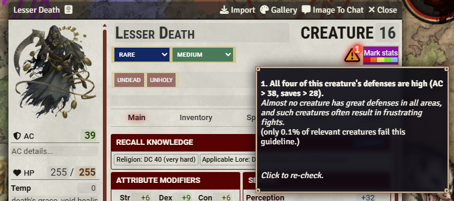
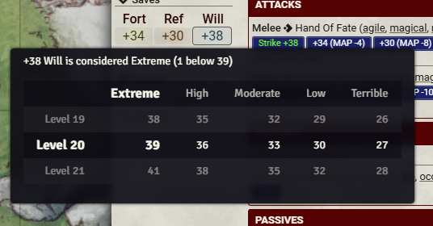
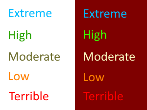
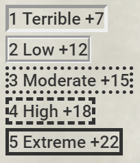

# [pF2e See Simple Scale Statistics](https://foundryvtt.com/packages/pf2e-see-simple-scale-statistics/)

FoundryVTT module for the PF2e system, which allows the GM to see where creatures' stats lie on the
Terrible-Low-Moderate-High-Extreme scale.

To install, browse for it in the module browser,
or [directly copy the manifest link for the latest release](https://github.com/shemetz/pf2e-see-simple-scale-statistics/releases/latest/download/module.json)
.

## Feature - Creature-building warnings

If the creature has problematic statistics, a list of warnings will appear, visible by hovering over the ⚠️ icon with
your cursor.

Warnings are based on the [Building Creatures guidelines](https://2e.aonprd.com/Rules.aspx?ID=2874), such as:

- creature has a statistic that is significantly beyond Extreme or beyond Terrible, e.g. AC 50 at level 10
- creature has no low primary statistics at all (ac, hp, saves, attacks, damages, spell dc -- all at Moderate scale or
  higher)
- creature has four high (or extreme) defenses
- creature has extreme AC and high HP
- creature has a high attack bonus with extreme damage
- low-level creature has both a fly speed and a ranged attack
- creature with the devil trait is missing the fiend trait
- creature with the fiend trait is missing the unholy trait or missing weakness to holy damage (this is very common in
  pre-Remaster creatures!)

All of these guidelines are being followed by the majority of official creatures -- most of them are 95% followed or
99% followed.

Outliers that are commonly broken but I still chose to warn about:
- low-level flying with ranged attack - 20% of the low-level flying creatures break it, but it's still helpful to see
- creatures with the fey trait that don't have weakness to cold iron (25% of fey creatures break this)

Some examples of problematic creatures that will trigger warnings: Lesser Death. Tzitzimitl, Floolf

## Feature - Color-coded statistics

Click the new button on the top right of each NPC character sheet to toggle the mod's functionality (setting is
client-side and global for all sheets).

Each important statistic of the creature will be recolored to indicate where it lies on a simple scale!

You can hover over these statistics to see additional context, the rows from the [guidelines](https://2e.aonprd.com/Rules.aspx?ID=2874)
that match the creature's level, showing why this number was colored the way it was.

### Use cases (for the GM)

- When a player uses Recall Knowledge and you want to tell them about well-known stats, or about whether a particular
  stat is high or low.
- When you want to quickly grasp roughly how a creature is meant to be played (brute, sniper, etc), at a glance
- When you're homebrewing or altering a creature - you want to avoid having too many extreme stats.

### Supported stats

All stats mentioned in [Building Creatures](https://2e.aonprd.com/Rules.aspx?ID=995) are supported.
However, special features like Regeneration or Sneak Attack aren't taken into account.

- AC
- HP
- Perception
- Saves: Fortitude, Reflex, Will
- Abilities: Strength, Dexterity, Constitution, Intelligence, Wisdom, Charisma
- Resistances and Weaknesses (**note**: colors are flipped for weaknesses, because it's a negative attribute to have)
- Strikes (for each attack): Attack bonus and average damage (**note**: this does not take any traits or other features
  into account)
- Spellcasting (for each spellcasting ability): Attack bonus and DC

The module will ignore Elite/Weak, disabling itself while those templates are active.

### Colors

Colors are cyan (Extreme), green (High), yellow (Moderate), orange (Low), and red (Terrible).

### Borders

To improve accessibility for color-blind folks, there's also a setting to use borders.

Border scale is: solid (Extreme), dashed (High), dotted (Moderate), groove (Low), and inset (Terrible).

### Where is the scale taken from?

[Building Creatures](https://2e.aonprd.com/Rules.aspx?ID=995), from the official Pathfinder 2e rules.

This is opinionated and some extra steps are taken:

- I added my own definition of "Terrible" for some scales that were missing explicit values, defining it as the Low
  value reduced by its difference to the Moderate value and further decreased by 1.
  It feels pretty good, but technically it's not the same as the official definition. I don't have a PhD in
  terribleness.
- If a resistance/weakness is "all"/"physical" (a "broad" resistance) it will count as double its value, to more
  explicitly warn against high broad resistances.
- Persistent damage is treated as 1.5x as strong as normal damage
- Splash damage is treated as 2x as strong as normal damage
- I "tiebreak" towards moderate, so e.g. if +15 is High and +13 is Moderate and +11 is Low, a +14 will count as Moderate
  and a +12 will also count as Moderate.
- Creatures above level 24 (i.e. the Tarrasque) are treated as level 24

Obviously, some aspects are ignored, so don't put TOO much stock in what the module says:

- Strike damage sometimes includes a passive increase (e.g. the Azer's 1d6 fire damage) which is not taken into account
  and thus is calculated as if it were lower
- Strike traits and special effects are ignored even if they're important for the damage calculation (too hard to
  implement)
- Special exceptions to defenses (e.g. AC with/without shield, will save bonus against mental) are ignored

## Discussion

You can discuss this module in its [dedicated thread in the Pathfinder on Foundry discord server](https://discord.com/channels/880968862240239708/1384807515967193098), or open a github issue here if it's a bug or a feature request.
